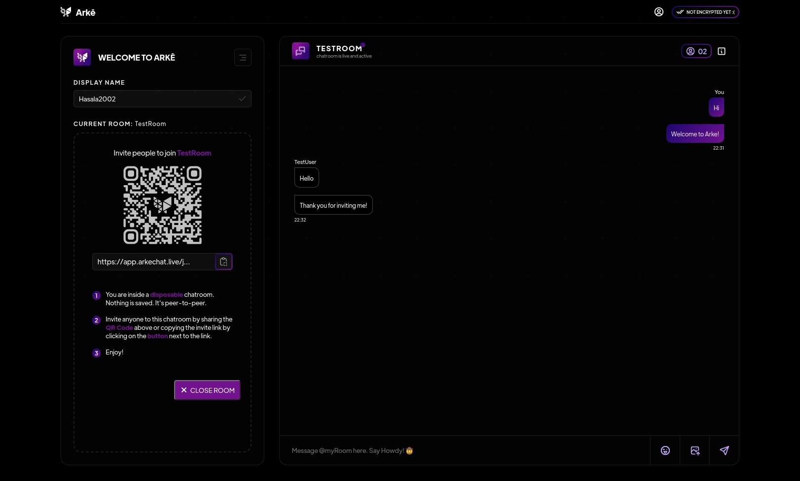
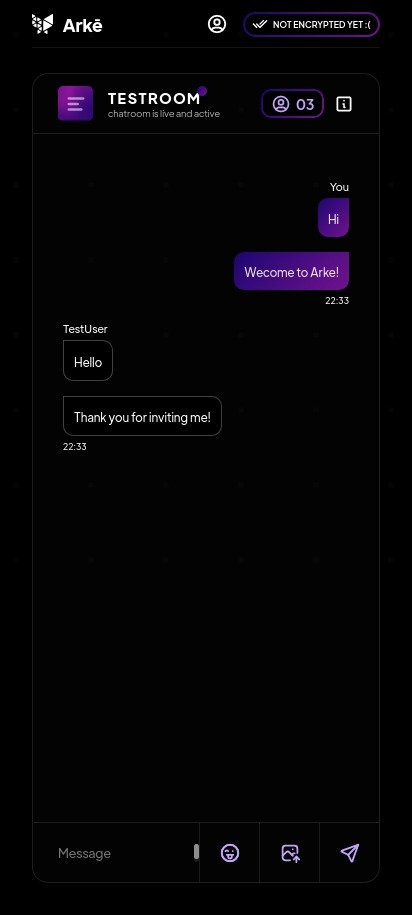

# Arkē Chat

With Arkē Chat you can create your own disposable chatroom, invite other people to chat with you and not worry about anyone else snooping into your conversation. Nothing is saved. ;)

> Read More at https://arkechat.live

## How it works.

I don't really have any idea either.

I think when you open the app, you get redirected a newly created room under a random id number, where you can invite other peers to join said room.

The room is created using Socket.io rooms.

Messages are sent through web socket requests.

### Dependencies

**Backend**

1. Socket.io
2. UUID
3. Express

> https://github.com/Hasala2002/arke-backend

**Frontend**

1. Socket.io Client
2. Tabler Icons
3. React Linkify
4. React ClipBoard
5. React Router Dom
6. React QRCode
7. UUID
8. Sass

**Setup locally**

> First clone the repo as shown below.

    $ git clone https://github.com/Hasala2002/arke.git

> And then go into the directory;

    $ cd arke

> Install dev dependencies with Yarn or NPM, I recommend Yarn

    $ yarn install
    //or
    $ npm install

**Start Server**

    $ yarn run dev
    //or
    $ npm run dev

> Go to http://localhost:5173 to view the local deploy. Edit and save files, then refresh to reload updates.
