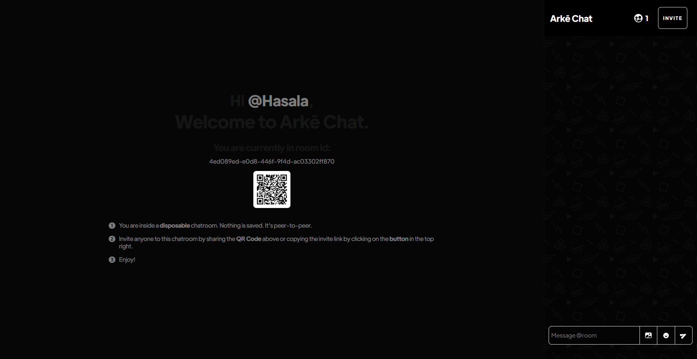
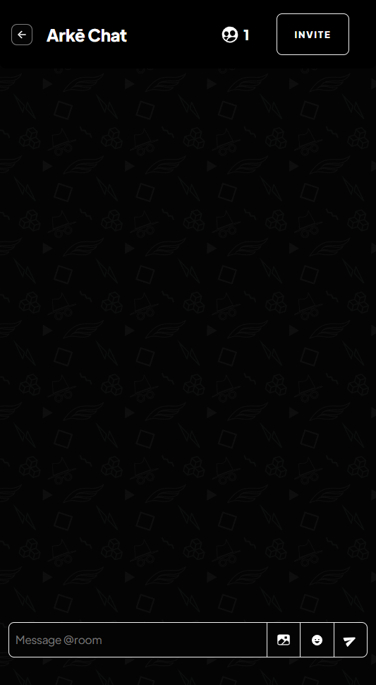

# Arkē Chat

With Arkē Chat you can create your own disposable chatroom, invite other people to chat with you and not worry about anyone else snooping into your conversation. Nothing is saved. ;)

## How it works.

I don't really have any idea either. 

When you open the app, you get redirected a newly created room under a random id number, where you can invite other peers to join said room. 

The room is created using Socket.io rooms. The client side app uses peerjs to connect to the socket.io room. The

Messages and Images are sent through web socket requests. 

Images are compressed to a maximum of 700kb.

### Dependencies

**Backend**

1. Socket.io
2. peerjs
3. UUID
4. Express
5. EJS
6. @hasala2002/chronos

**Frontend**

1. Socket.io
2. peerjs
3. browser-image-compression
4. jquery
5. linkify
6. qrcode.js
7. Ionic Icons
8. emoji-picker-element

**Setup locally**

> First clone the repo as shown below.

    $ git clone https://github.com/Hasala2002/arke.git

>And then go into the directory;

    $ cd arke
>Install dev dependencies with Yarn or NPM, I recommend Yarn

    $ yarn install
    //or
    $ npm install

**Start Server**

    $ nodemon server.js

>Go to http://localhost:3000 to view the local deploy. Edit and save files, then refresh to reload updates.

> Credits to https://codepen.io/cvaneenige for CSS Wing Animation